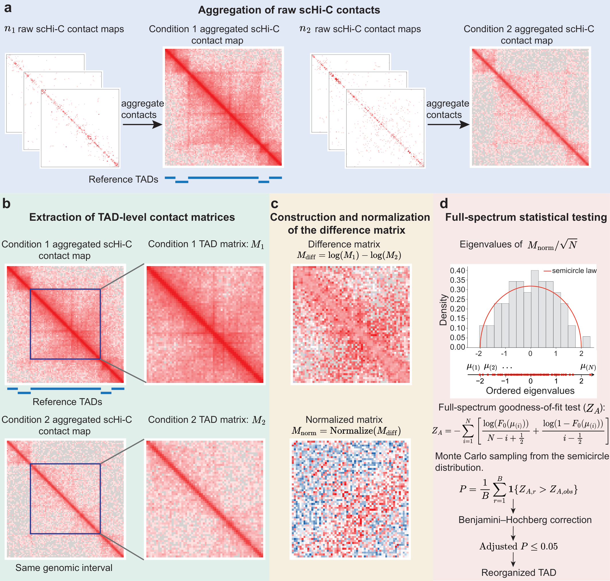

# DiffDomain-Spectrum

*Enhanced detection of reorganized TADs using sparse aggregated single-cell Hi-C
contact maps.*

DiffDomain-Spectrum detects whether a topologically associating domain (TAD) is
significantly **reorganized between two conditions**. Unlike **DiffDomain**, which
only uses the largest eigenvalue of the normalized difference Hi-C matrix, this
method performs a **full-spectrum goodness-of-fit test**: *all* eigenvalues of the
distance-normalized log-ratio contact matrix are compared with the Wigner
semicircle law, so reorganizations that leave the largest eigenvalue unchanged are
still detected.

This repository hosts **two implementations of the same method**:

| Implementation | Language | Location | Entry point |
|---|---|---|---|
| `DiffDomainSpectrum` R package | R | repository root (`DESCRIPTION`, `R/`, `man/`) | `DiffDomain_Spectrum()`, `DiffDomain_Spectrum_parallel()` |
| `spectrum` command-line tool | Python | [`python/`](python/) | `python codes_run_spectrum.py ...` |

Given two contact maps built on the same genomic interval and resolution, both
implement the same pipeline:

1. **extract** the TAD-level contact matrix `M` of a reference TAD from each
   condition,
2. **build and normalize** the difference matrix `M_diff = log(M1) - log(M2)`,
   standardizing each off-diagonal by its mean/sd to obtain `M_norm`,
3. **test** the eigenvalue spectrum of `M_norm / sqrt(N)` against the Wigner
   semicircle law with a Monte-Carlo null distribution (`Z_A` statistic),
4. **correct** the resulting p-values with the Benjamini-Hochberg procedure to
   call **reorganized TADs**.



**Figure 1 | DiffDomain-Spectrum workflow.**
**a** Raw scHi-C contact maps are aggregated per condition into one
condition-level contact map. **b** For each reference TAD, the corresponding
TAD-level contact matrices `M1` and `M2` are extracted from the two aggregated
maps over the same genomic interval. **c** The difference matrix
`M_diff = log(M1) - log(M2)` is computed and normalized off-diagonal-wise to
`M_norm`. **d** The eigenvalues of `M_norm / sqrt(N)` are compared with the
Wigner semicircle law through a full-spectrum goodness-of-fit statistic `Z_A`;
a Monte-Carlo p-value is obtained by sampling from the semicircle distribution
and corrected with the Benjamini-Hochberg procedure (`adjusted P <= 0.05`).

> **Scope.** Step **a** (aggregation of raw scHi-C contacts) is performed
> upstream by the single-cell Hi-C processing pipeline. **Both implementations
> start from aggregated contact maps** and implement steps **b-d**.
> Original vector figure: [`workflow.pdf`](workflow.pdf).

---

## Which implementation should I use?

|  | R package | Python CLI |
|---|---|---|
| **Install** | `devtools::install_github("FocusPaka/DiffDomain-Spectrum")` | `conda env create -f python/environment.yml` |
| **Input formats** | `.hic` (via `strawr`) | `.hic` (via `hic-straw`) **and** `.cool` / `.mcool` (via `cooler`), plus plain 3-column sparse matrices |
| **Parallelism** | `future` + `furrr` | `joblib` |
| **Batch driver** | `DiffDomain_Spectrum_parallel()` | `dvsd multiple` |
| **Extra tools** | — | `visualization` (triangle plot) and `adjustment` (multiple-testing correction) subcommands |
| **TAD calling** | `identifyTADs_HiC()` included | not included — supply a BED of reference TADs |

Use the **R package** if you work inside R / Bioconductor, want the function to
return an `htest` object, or need the bundled TAD identification step. Use the
**Python tool** if your contact maps are `.cool`/`.mcool` files, if you want a
batch command line with BH correction built in, or if you are integrating the
method into a Python pipeline.

---

## Repository layout

```
DiffDomain-Spectrum/
├── DESCRIPTION            # R package metadata
├── NAMESPACE
├── LICENSE
├── R/                     # R package source (10 functions)
├── man/                   # roxygen-generated .Rd documentation
├── .Rbuildignore          # keeps the Python implementation out of the R tarball
├── .gitattributes         # line-ending policy (see the note below)
├── .gitignore             # excludes Hi-C data, caches and local test scripts
├── assets/workflow.png    # README preview of the workflow figure
├── workflow.pdf           # original vector workflow figure
├── python/                # Python implementation (self-contained)
│   ├── README.md          #   detailed Python usage
│   ├── codes_run_spectrum.py
│   ├── functions.py
│   └── environment.yml
└── README.md
```

> **Note on line endings.** `DESCRIPTION`, `NAMESPACE` and `R/*.R` are stored
> with CRLF, while `README.md`, `LICENSE`, `man/*.Rd` and everything under
> `python/` use LF. `.gitattributes` therefore forces LF only for the *new*
> text file types (`.py`, `.sh`, `.yml`, `.md`, `.txt`, dotfiles) and
> deliberately says nothing about the R sources: declaring `text` for them
> would renormalise the 13 already-committed CRLF files and turn a one-line
> change into an "every line changed" diff.

---

## Function correspondence

The two implementations are line-by-line ports of each other:

| R — `R/*.R` | Python — `python/functions.py` | Note |
|---|---|---|
| `DiffDomain_Spectrum(x, y, N)` | `spectrum_test_parallel(Mat, N)` | Python computes `eigvalsh(Mat / sqrt(n))` internally and returns `(Z_A, p, n)` |
| `DiffDomain_Spectrum_parallel(...)` | `comp2domins_by_spectrum(...)` + `loadtads()` | batch driver over a TAD list |
| `identifyTADs_HiC(x, tadlist, ...)` | *(inlined in `comp2domins_by_spectrum`)* | per-TAD worker: extract → filter sparse bins → ratio → normalize → eigendecompose → test |
| `contact_matrix_from_hic(chrn, start, end, reso, fhic, hicnorm)` | `contact_matrix_from_hic(chrn, start, end, reso, fhic, hicnorm)` | R uses `strawr`; Python dispatches on the file extension |
| `extractKdiagonalCsrMatrix(spsCsrMat)` | `extractKdiagonalCsrMatrix(spsCsrMat)` | groups entries by `|i-j|` |
| `makewindow(start, end, reso)` | `makewindow2(start, end, reso)` | bin boundaries `floor(start/r)*r … ceiling(end/r)*r` |
| `normDiffbyMeanSD(Diffmat)` | `normDiffbyMeanSD(D)` | `log` transform, per-off-diagonal mean/sd, NaN/Inf imputation |
| `sdAdjust(v)` | `np.std(v)` | R's `sd(v)*sqrt((n-1)/n)` is exactly NumPy's default population sd (`ddof=0`) |
| `rvs(size, beta=1, center=0, sigma=1)` | `WignerSemicircle(R=2).rvs(size)` | identical: `4u - 2`, `u ~ Beta(1.5, 1.5)` |
| `semicircle_cdf(x)` | `WignerSemicircle(R=2).cdf(x)` | identical closed form |

---

## Installation

### R

```r
library("devtools")
devtools::install_github("FocusPaka/DiffDomain-Spectrum")
library("DiffDomainSpectrum")
```

The package can also be installed from a local clone:

```r
devtools::install("path/to/DiffDomain-Spectrum")
```

### Python

```bash
git clone https://github.com/FocusPaka/DiffDomain-Spectrum.git
cd DiffDomain-Spectrum/python
conda env create --name spectrum -f environment.yml
conda activate spectrum
```

Full Python usage — subcommands, input/output formats and options — is documented
in [`python/README.md`](python/README.md).

---

## Quick start

### R

```r
library("DiffDomainSpectrum")

DiffDomain_Spectrum_parallel(
  tadlist_path = "tads.txt",   # tab-separated, header row, columns: chr start end ...
  fhic0        = "condition_A.hic",
  fhic1        = "condition_B.hic",
  min_nbin     = 8,
  hicnorm      = "KR",         # NONE / VC / VC_SQRT / KR
  reso         = 10000,
  prop         = 0.5,
  save_path    = "results.txt"
)
```

Or test a single TAD by hand:

```r
eigv <- eigen(normDiffbyMeanSD(M1 / M2) / sqrt(nrow(M1)), symmetric = TRUE,
              only.values = TRUE)$values
DiffDomain_Spectrum(eigv, N = 10000)
```

### Python

```bash
cd python

# one domain
python codes_run_spectrum.py dvsd one "X" 154425001 154700001 \
    A.hic B.hic --reso 25000 --hicnorm NONE

# a whole TAD list, then BH correction
python codes_run_spectrum.py dvsd multiple A.hic B.hic tads.bed \
    --reso 25000 --chrn ALL --ncore 10 --ofile results.txt
python codes_run_spectrum.py adjustment fdr_bh results.txt results_adj.txt
```

---

## Citation

If you use this tool, please cite:

- **DiffDomain-Spectrum: enhanced detection of reorganized TADs using sparse
  aggregated single-cell Hi-C contact maps**.
---

## License

This project is released under the **GNU General Public License, version 2
(GPL-2)**. The full license text is in [`LICENSE`](LICENSE).

The R package metadata declares it as `License: GPL-2 | file LICENSE` — the
`| file LICENSE` part is the R convention that tells `R CMD check` the `LICENSE`
file is part of the package metadata (without it, the check raises a NOTE about
an unmentioned top-level file). The declared license is still GPL-2.

If any code here was adapted from another project, that project's upstream
license must be preserved as well.


